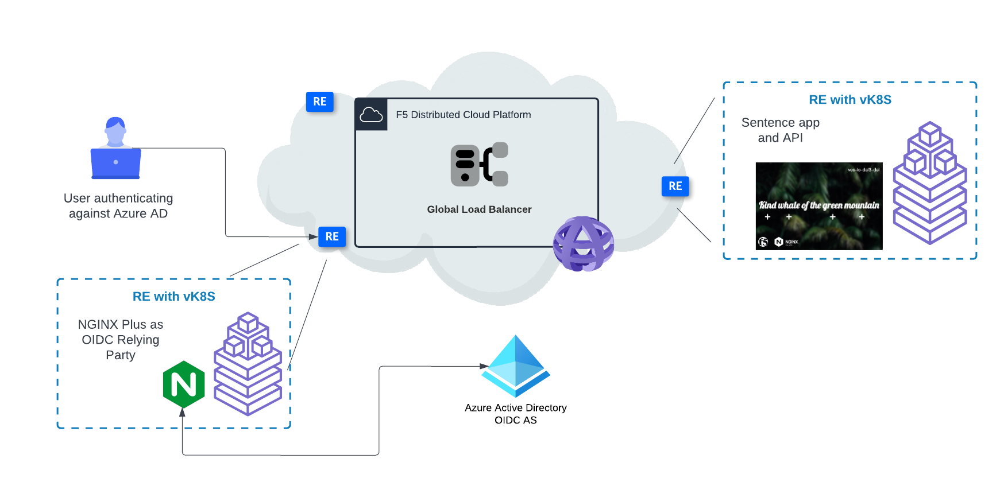
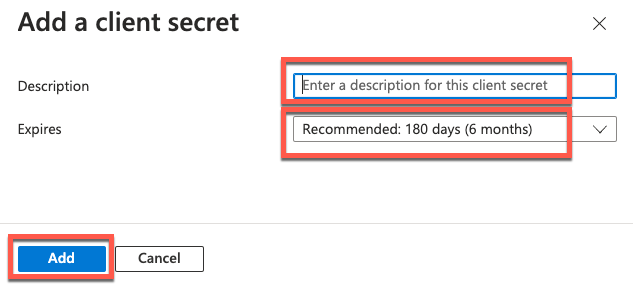

# terraform-nginx-auth

Terraform solution accompanying F5 DevCentral article [Bolt-on Auth with NGINX and F5 Distributed Cloud](https://community.f5.com/t5/technical-articles/bolt-on-auth-with-nginx-and-f5-distributed-cloud/ta-p/320879).



## Deployment Steps

### Tools Needed

This solution makes modest use of automation for the deployment. However, there are several preparatory steps that need to occur manually. The tools required are:

* Docker Desktop
* Terraform
* A GitHub account
* An Azure account (we will be using Microsoft Entra ID ([formerly Azure Active Directory](https://learn.microsoft.com/en-us/azure/active-directory/fundamentals/new-name)) as our OIDC Identity Provider)
* Microsoft Entra ID configured with user accounts
* Git
* An F5 Distributed Cloud account

### Building the NGINX Plus Container Image

To enable [OpenID Connect-based single sign-on](https://github.com/nginxinc/nginx-openid-connect), we will need to employ the use of [NGINX Plus](https://www.nginx.com/products/nginx/). We will create a container image of NGINX Plus, complete with the [auth\_jwt](https://nginx.org/en/docs/http/ngx_http_auth_jwt_module.html) and [njs](https://nginx.org/en/docs/njs/index.html) modules. The following is a high-level overview of how this solution works:


We will make use of a [GitHub repository containing the Dockerfile](https://github.com/f5devcentral/nginx-unprivileged-f5xc/tree/main/OIDC) we will use to build the container image for this solution, as it has been pre-hardened to run in an unprivileged mode in vk8s.

Since NGINX Plus is commercial software, we will need to host the image we build in a private container registry. In this walkthrough, I will be using the GitHub Container Registry (ghcr). Here are the steps:

1. Clone the repository:

    ```shell
    git clone https://github.com/f5devcentral/nginx-unprivileged-f5xc
    ```

2. If you already have an NGINX Plus license, download the crt and key files from the MyF5 portal. New to NGINX Plus? You can [request a free 30-day trial](https://www.nginx.com/free-trial-request/) which includes a crt and key.

3. Copy the nginx-repo.crt and nginx-repo.key files to the root of the cloned repo. **Do not commit these files to Git!**

4. Run the Docker build command:

    ```shell
    export DOCKER\_DEFAULT\_PLATFORM=linux/amd64 
    sudo DOCKER\_BUILDKIT=1 docker build --no-cache --secret id=nginx-key,src=nginx-repo.key --secret id=nginx-crt,src=nginx-repo.crt -t nginx-oidc .
    ```

5. If the image build was successful, login to ghcr [using a developer token](https://docs.github.com/en/packages/working-with-a-github-packages-registry/working-with-the-container-registry#authenticating-with-a-personal-access-token-classic), tag the image, and push it to the registry:

    ```shell
    export $GITHUB\_USER=<your GitHub account> 
    export $GITHUB\_TOKEN=<your GitHub developer token> 
    echo $GITHUB\_TOKEN | docker login ghcr.io -u $GITHUB\_USER --password-stdin 
    docker tag nginx-oidc ghcr.io/$GITHUB\_USER/nginx-oidc 
    docker push ghcr.io/$GITHUB\_USER/nginx-plus-ingress
    ```

6. In your browser, navigate to `https://github.com/<your-github-account>?tab=packages` to ensure that it has been published. **Verify that the image is private!**

    

### Create the Azure OIDC Identity Provider

In this solution, we will be leveraging the authorization code flow, as depicted in the following diagram:


To do this, we need to configure Microsoft Entra ID to assume the role of Identity Provider (IDP).

1. Log into the [Azure Portal](https://portal.azure.com/) and select "Microsoft Entra ID":

    

2. Click "App registrations" then "New registration":

    

3. Give the application a name. This is the name that will appear in the Microsoft authorization request dialog when we test the solution later on. Select "Web" for Redirect URI type, and specify a redirect URI for this application. The URI must exactly match the hostname and port of the F5 Distributed Cloud HTTP Load Balancer that will be created when we use Terraform to deploy in a later step. The format needs to be: `https://your-fqdn-here:443/_codexch`

    

4. Click "Register".

5. Click "Certificates & secrets", then "New client secret":

    

6. In the resulting dialog, enter any value for the description, and choose an appropriate expiration date. Click "Add":

    

7. The new client secret will have been created. Copy the secret’s "Value" and keep it somewhere safe for a later step. **_Do this now - you will not have the ability to retrieve it later._**

    

8. Click "Overview". Locate and copy the **Application (client) ID** and **Directory (tenant) ID** values for use in a later step:

    

### Deploying the Solution

Earlier I mentioned that we would be configuring the cluster and deploying the application and NGINX Plus proxy. We will use Terraform to do this, with the help of another GitHub repository.

1. In the F5 Distributed Cloud console, create a new application namespace. Application namespaces create a logical separation for enhanced security between applications. This new namespace will be for the Sentence app and the NGINX Plus OIDC auth service. For example, "demo-nginx-auth".

2. In the F5 Distributed Cloud console, [create a Service Credential](https://docs.cloud.f5.com/docs/how-to/user-mgmt/credentials) that has the admin role for this newly created namespace.

3. Clone this repository:

    ```shell
    git clone https://github.com/f5devcentral/terraform-nginx-auth.git
    ```

4. Open the cloned repository in an editor such as [VS Code](https://code.visualstudio.com/). We will be editing multiple files there.

5. Make a copy of the **terraform.tfvars.example** file, and name it **terraform.tfvars**

6. In your **terraform.tfvars** file, make the following updates:

    1. Update lines **1-2** with information from your F5 Distributed Cloud tenant information. Both values can be seen in **Tenant ID** field of the Distributed Cloud console’s _Administration -> Tenant Overview_ page.

        Example: **Tenant ID: _&lt;tenant&gt;_\-_&lt;tenant\_suffix&gt;_**

    2. Update line **3** with the namespace name that you created in step 1.

    3. Update lines **5-8** with GitHub container registry information from the "Building the NGINX Plus Container Image" section of this guide.

    4. Update lines **10** and **13**. Change the "example.com" to a custom domain name you own that has been delegated to F5 Distributed Cloud. See [Domain Delegation](https://docs.cloud.f5.com/docs/how-to/app-networking/domain-delegation) for details on how to set this up in your tenant.

        > **NOTE:** The value on line **13 _must_** match the fqdn you used in step 3 of the "Create the Azure OIDC Identity Provider" section of this guide. If you need to, you can change the URL you set in that step using the Azure Portal.

    5. By default, the Sentence app will deploy to a Kubernetes cluster in the Dallas, Texas (U.S.) region, and the NGINX Plus OIDC auth service to a Kubernetes cluster in Seattle, Washington (U.S.). If you would like to update these, update lines **11** and **14** in your **terraform.tfvars** using values from this list.

### Configure NGINX Plus for OIDC Authorization

To secure the Sentence app and API, NGINX Plus needs to be configured variables that are required in the OIDC authorization flow. For details about this solution, see the [nginx-openid-connect repo](https://github.com/nginxinc/nginx-openid-connect). We will use Terraform variables to inject the secret values into the NGINX Plus config that will be installed in Kubernetes.

> **NOTE:** You will be populating the file below with sensitive information. **Do not** commit this file into a public repository. Ideally, these values should be stored in a secure enclave to prevent unintended disclosure.

1. In your terraform.tfvars file, make the following updates:

    1. On line **16**, replace **_&lt;Azure Tenant (directory) ID&gt;_** with the value from Step 8 in the "Create the Azure OIDC Identity Provider" section earlier in this guide.

    2. On line **17**: Replace **_&lt;Azure Application (client) ID&gt;_** with the value from Step 8 in the "Create the Azure OIDC Identity Provider" section earlier in this guide.

    3. On line **18**: Replace **_&lt;Azure Client Secret Value&gt;_** with the value from Step 7 in the "Create the Azure OIDC Identity Provider" section earlier in this guide.

    4. Optionally, for extra security, you can update the random phrase on line **19** used as an OIDC hmac key to ensure nonce values used in the authorization flow are unpredictable.

2. Save the file.

### Create an API Key for Distributed Cloud

To programmatically interact with F5 Distributed Cloud, you must create an API certificate in the PKCS (.p12) format.

1. Follow the procedure to [create an API Certificate](https://docs.cloud.f5.com/docs/how-to/user-mgmt/credentials#service-credentials) for the Service Credential you created earlier.

2. Download the API certificate’s p12 file.

3. In the shell you will execute Terraform in, set the following environment variables:

    ```shell
    export VES\_P12\_PASSWORD=<your .p12 file password>
    export VOLT\_API\_P12\_FILE=<full path to your .p12 file>
    ```

### Deploy the Solution with Terraform

We will run Terraform plan and apply in 2 different phases: One to create the F5 Distributed Cloud vk8s clusters and return their respective kubeconfig files, and the next phase to install the actual resources to the Kubernetes clusters.

1. In the same shell as above, run Terraform init to download the providers needed for the solution, and prepare for the next steps:

    ```shell
    terraform init
    ```

2. Run Terraform plan to see a list of all the resources that will be created for the cluster creation phase:

    ```shell
    terraform plan -target=module.xc-re-vk8s-kubeconfig
    ```

3. Scroll through the list of all the resources that Terraform plans to create. Note all the resources that will be created:

    * A Virtual Kubernetes cluster, deployed in 2 different regions
    * A Kubeconfig file used to deploy the Sentence app and NGINX Plus OIDC manifests to the newly created

4. If you are satisfied with the list of resources created and there were no errors reported by the previous step, run Terraform apply:

    ```shell
    terraform apply -target=module.xc-re-vk8s-kubeconfig
    ```

    >**NOTE:** When prompted to confirm the apply step, type "yes".

5. Now that the cluster has been provisioned, run a Terraform plan to review the remainder of the solution to be deployed:

    ```shell
    terraform plan
    ```

6. Scroll through the list of all the resources that Terraform plans to create. Note all the resources that will be created:

    * 2 load balancers and origin pool pairs
    * Kubernetes manifests for deploying all the needed resources into the clusters (ConfigMaps, Secrets, Deployments, Services)

    >**NOTE:** Terraform will report the existence of the items that were created in step 4. Not to worry - Terraform is already aware of these object that were created and will not unnecessarily re-create them.

7. If you are satisfied with the list of resources created and there were no errors reported by the previous step, run Terraform apply:

    ```shell
    terraform apply
    ```

    > **NOTE:** When prompted to confirm the apply step, type "yes".

8. If there are no errors, the entire solution is now deployed.

### Test the Deployed Solution

1. In your browser, navigate to the NGINX Plus OIDC auth site. Hint: this is the host you entered into the terraform.tfvars file, line **13**.

2. You should be redirected to Microsoft login screens, requesting your authorization for the application to use your ID to authenticate to the Sentence app.

3. Once authenticated, you should be allowed to access the Sentence app:

    

### Examine the Deployed Solution

1. Log into the F5 Distributed Cloud console.

2. Navigate to "Distributed Apps".

3. Select the namespace you created earlier in the top left menu.

4. Click on "Applications" -> "Virtual K8s".

5. Note that a cluster has been created and is showing a "Ready" status:

    

6. Click on the cluster link. Here you can examine the Services, Deployment objects, and Pods that were deployed to the cluster.

7. Click "Load Balancers" -> "HTTP Load Balancers". Click on each of the Load Balancers that were created and examine the metrics available. Note that the deployed applications are healthy.

### Cleanup

A benefit of using Terraform is that removing all the resources it created in F5 Distributed Cloud is just as easy as creating them. For this, use Terraform destroy, and type "yes" when prompted:

```shell
terraform destroy
```

>**NOTE:** Remember to delete the API Credential and namespace you created in the F5 Distributed Cloud console if you no longer need them.

[Back to DevCentral article](https://community.f5.com/t5/technical-articles/bolt-on-auth-with-nginx-and-f5-distributed-cloud/ta-p/320879)
